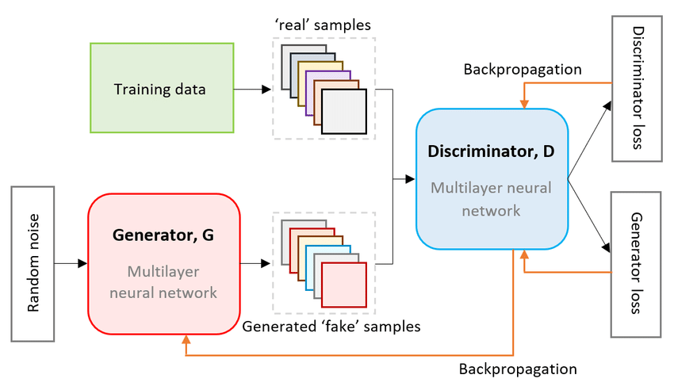

# GAN (Generative Adversarial Network) Model
These are powerful class of neural networks that are used for unsupervised learning. GAN is made of 2 neural networks

 - Discriminator: It is a neural network which is used to classify the images into two classes i.e. real and fake.
  
 - Generator: It is a neural network which generates data when random noise is feeded into it. The Generator attempts to fool the Discriminator, which is tasked with accurately distinguishing between produced and genuine data, by producing random noise samples.

### Dataset Used
[Anime Face Dataset](https://www.kaggle.com/datasets/splcher/animefacedataset)

### Technologies Used
- Pytorch
- Torchvision
- Numpy
- Matplotlib
- Kaggle